# Práctica: Creación y Gestión de Base de Datos EcommerceDB

## 1. Configuración Inicial
**Create a new database**

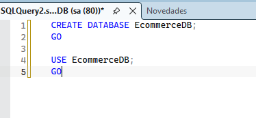

---

## 2. Creación de Tablas y Carga de Datos

**Create core tables with constraints**
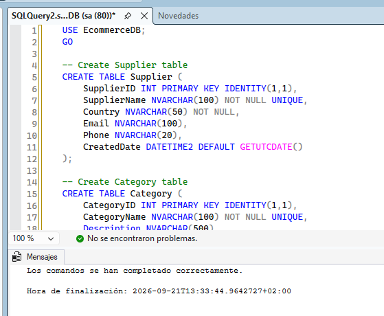

**Insert sample data into the tables**
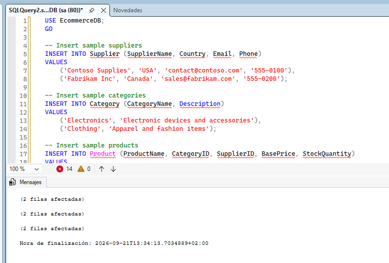

**Configuración adicional de la base de datos**
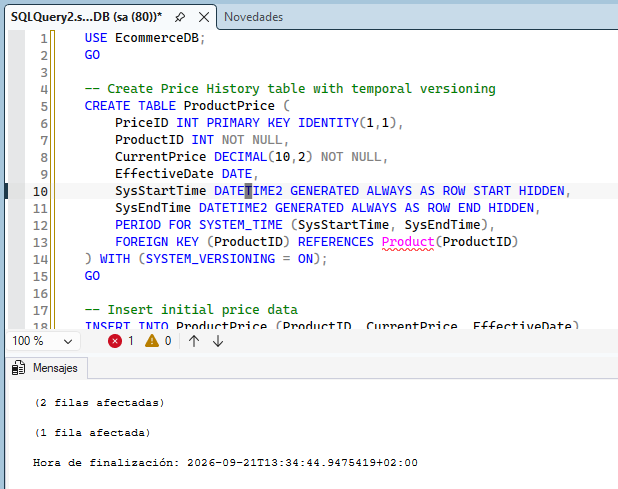

---

## 3. Consultas de Historial

**Query the price history to see changes over time**
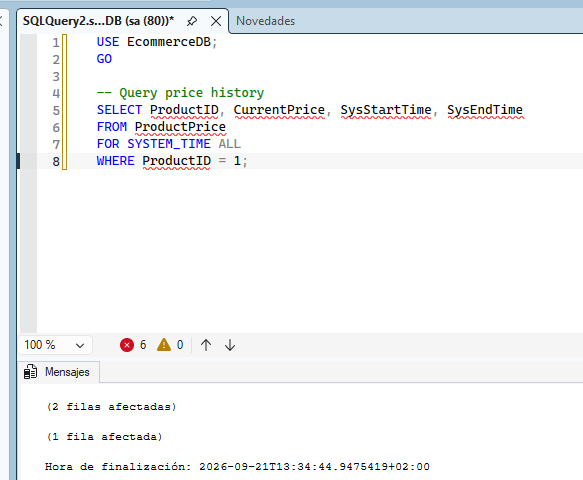

---

## 4. Gestión de Datos JSON

**Implementación de metadatos JSON**
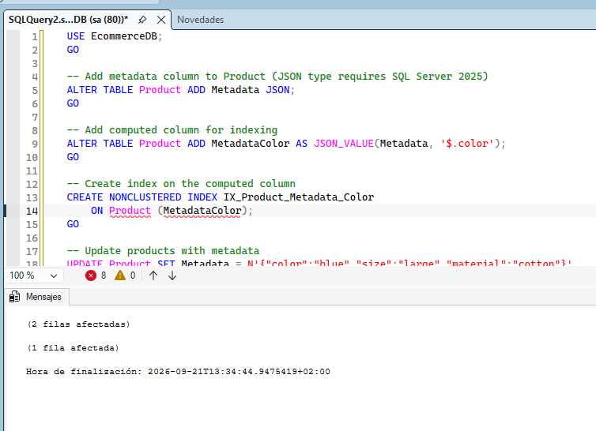

**Query the JSON data**
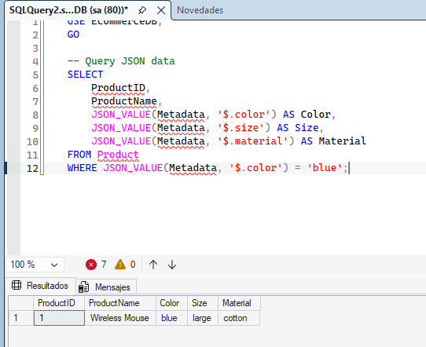

---

## 5. Particionamiento de Tablas
*Partitioning divides large tables into smaller segments for faster queries and easier maintenance. This task creates a partitioned orders table.*

**Create a partitioned order table**
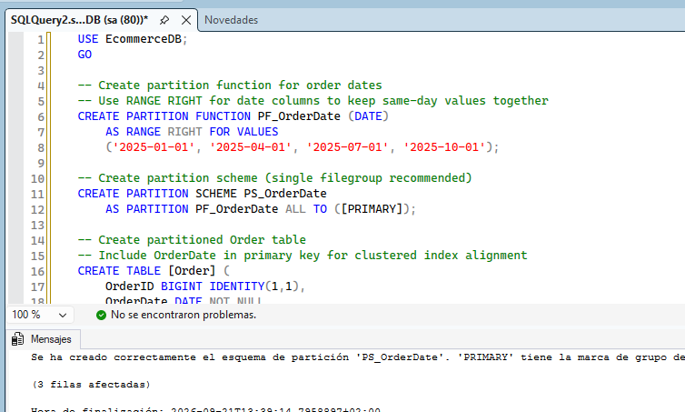

**Query by partition**
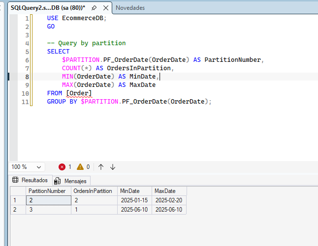

---

## 6. Uso de Secuencias
*Sequences generate unique numbers independently of any table. This task uses a sequence for order line item identifiers.*

**Create order details with SEQUENCE**
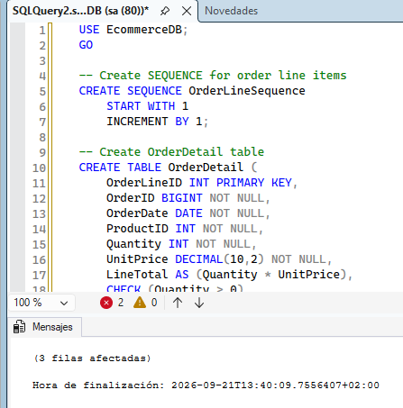

**Verify the data**
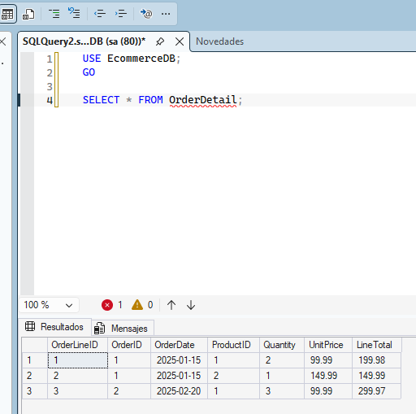

---

## 7. Verificación de Objetos y Restricciones
*Run verification queries to ensure all database objects were created correctly.*

**Verify database objects**
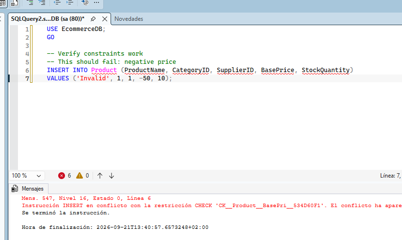

> 📝 **Nota de validación:** This query should fail with a CHECK constraint violation, confirming that the constraint is working correctly.

**Verify the JSON and partitioning queries**
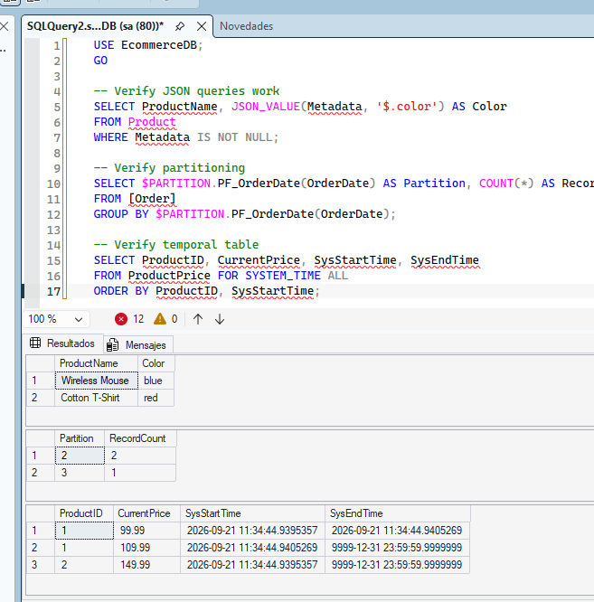